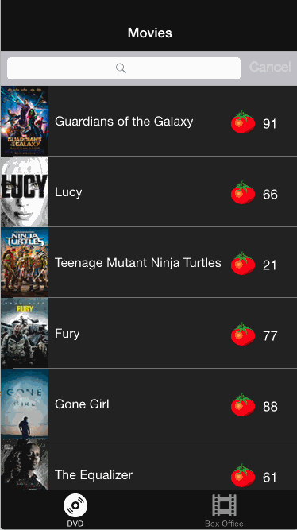

## Rotten Tomatoes

This is a movies app displaying box office and top rental DVDs using the [Rotten Tomatoes API](http://developer.rottentomatoes.com/docs/read/JSON).

Time spent: 15 hrs

### Features

#### Required

- [x] User can view a list of movies. Poster images load asynchronously.
- [x] User can view movie details by tapping on a cell.
- [x] User sees loading state while waiting for the API.
- [x] User sees error message when there is a network error: http://cl.ly/image/1l1L3M460c3C
- [x] User can pull to refresh the movie list.

#### Optional

- [x] All images fade in.
- [x] For the larger poster, load the low-res first and switch to high-res when complete.
- [ ] All images should be cached in memory and disk: AppDelegate has an instance of `NSURLCache` and `NSURLRequest` makes a request with `NSURLRequestReturnCacheDataElseLoad` cache policy. I tested it by turning off wifi and restarting the app. (I did a different sort of caching, which is likely the incorrect way. Saved the image to the movie object once it had been loaded.)
- [x] Customize the highlight and selection effect of the cell.
- [x] Customize the navigation bar.
- [x] Add a tab bar for Box Office and DVD.
- [x] Add a search bar: pretty simple implementation of searching against the existing table view data. (Actually I searched against all of RT database for this one)

### Walkthrough

* User can view the list of movies
* Async poster loading
* Look at details by tapping on the cell
* Pull to refresh (sadly the list doesn't change frequently enough)
* Sees a loading state, loads the thumb before the high rest 
* Can search through all of RottenTomatoes database.

### 

* Fading images (I chose to do this only on the app start)

### 

* Display an error when there's no network

Notes: This was definitely a good exercise in building out a more thorough product than the tip calculator. I would definitely organize some things differently in the project if I did it again

Credits
---------
* [Rotten Tomatoes API](http://developer.rottentomatoes.com/docs/read/JSON)
* [AFNetworking](https://github.com/AFNetworking/AFNetworking)